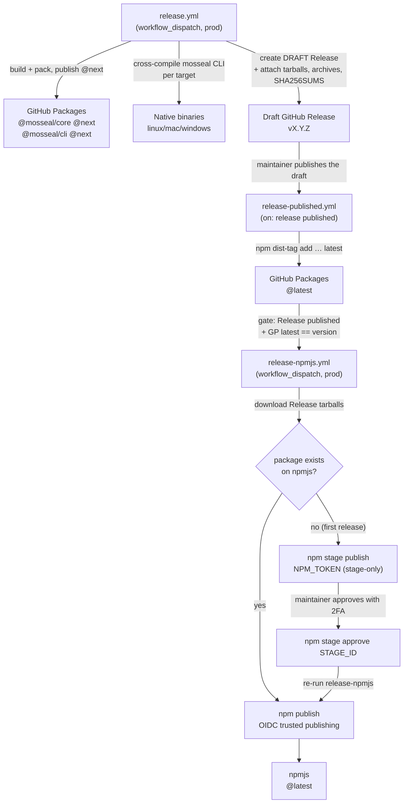

# Development Notes

Operational notes for working on MOSSEAL itself (not for consumers — see the
package READMEs for that). The normative specs live in [`specs/`](../specs/);
this file captures the build/dependency conventions that are not part of the
wire format or public API, plus the CI and publishing pipeline.

## Dependency policy

- Direct dependencies use current compatible major/minor releases; patch updates
  remain routine lockfile maintenance.
- Workspace MSRV is **Rust 1.85**, driven by the current crypto, obfuscation,
  rand, getrandom, and test releases.
- Primary randomness chain: `rand 0.10` + `getrandom 0.4` (`wasm_js`).
  Note that `obfuse` brings in legacy `crypto-common` / `rand_core 0.6`, which
  pulls `getrandom 0.2`; wasm builds must also activate `getrandom 0.2`'s `js`
  feature (declared as an aliased direct dep in the wasm crates and the template).
- **Dependency cleanup (2026-09-26):** removed unused direct deps found by manual
  audit (cargo-machete was not installed at the time): workspace `hmac`, `subtle`,
  `hex-literal`, `proptest`; core `chacha20poly1305`, `hmac`, `subtle`, `serde`,
  `hex`, `obfuse`, dev `hex-literal`/`proptest`; wasm `thiserror`, `base64`; CLI
  `serde`, `serde_json`, `hex`; template `base64`. `zeroize` now enables its
  `derive` feature explicitly (previously pulled in transitively). `obfuse` stays
  in the wasm crates because the **generated** `secrets.rs` references `obfuse!`.
- The `supply-chain` CI job enforces this with `cargo deny` (advisories, license
  allow-list, banned crates, crates.io-only sources) and `cargo machete` (no
  unused direct deps). See [`deny.toml`](../deny.toml).

## Vendored `mosseal-core` crate

`packages/mosseal/template/mosseal-core-<ver>.crate` is a **packaged snapshot** of
`crates/mosseal-core`, shipped inside the `mosseal` npm package so the CLI can
compile the template without publishing `mosseal-core` to crates.io.

It is a **derived artifact and is deliberately NOT committed** (see `.gitignore`).
It is regenerated automatically:

- by `npm pack` / `npm publish` in `packages/mosseal` (the `prepack` script),
- by the conformance-wasm builder (`packages/core/test/build-conformance-wasm.mjs`)
  when it is missing — so `npm test` / `npm run test:e2e` in `packages/core` work on a
  fresh clone, and
- on demand via `npm run sync:core` (from `packages/mosseal`), or
  `node scripts/sync-core-crate.mjs` from the repo root.

Because it is generated on demand, it **cannot drift** from `crates/mosseal-core`
— there is no manual refresh step. The `packages` CI job packs the CLI and asserts
the crate lands in the tarball.

`node scripts/release.mjs --version <X.Y.Z>` also regenerates it as part of a release
bump (see [`docs/versioning.md`](versioning.md)). The unpacked
`packages/mosseal/template/mosseal-core-*/` directory is gitignored — the CLI builder
unpacks the `.crate` into its temp build dir.

## Local verification

Run the same checks CI runs before pushing:

```bash
cargo fmt --all --check
cargo clippy --workspace --all-targets -- -D warnings
cargo test --workspace
cargo run -p mosseal-vectors -- --check   # conformance-vector drift tripwire
cargo deny --all-features check && cargo machete   # needs cargo-deny / cargo-machete
```

JS/TS packages and the browser suite are documented in the root
[`README.md`](../README.md#development--testing).

## CI & Publishing

### Repository CI (`.github/workflows/ci.yml`)

Runs on every push to `prod` and every pull request. Nine jobs:

| Job | Runner | What it guards |
|---|---|---|
| `rust-native` | ubuntu + windows | `cargo fmt --check`, strict `clippy`, `cargo test --workspace` (incl. the deterministic `fuzz_smoke` suite), and the `vectors.json` drift tripwire. |
| `fuzz-smoke` | ubuntu (nightly) | 60 s each on the `decode` / `open` `cargo fuzz` targets. |
| `supply-chain` | ubuntu | `cargo deny` (advisories, license allow-list, banned crates, crates.io-only sources) + `cargo machete` (no unused direct deps). |
| `coverage` | ubuntu | `cargo llvm-cov` summary uploaded as an artifact. **Report-only** — no floor yet. |
| `wasm-test` | ubuntu (node + chrome) | `wasm-pack test` for the wasm-only surface; the Chromium leg exercises `web_sys::window` hostname detection. |
| `wasm-node` | ubuntu | Builds the conformance wasm and runs the byte-exact vector suite + URL/QR budget + Argon2 timing. |
| `wasm-browser` | ubuntu (chromium) | Playwright: cross-host portability, `DOMAIN_MISMATCH`, strict/lenient net-time matrix, custom `MOSSEAL_TIME_SOURCES`, no-fragment-leak assertion. |
| `packages` | ubuntu | Builds both packages, runs the CLI unit tests, and packs the CLI (asserting the derived vendored crate lands in the tarball). |
| `doctor-clean` | ubuntu (`node:22-bookworm`) | `mosseal doctor` + an end-to-end `init`/`build` from the **packed tarball** in a clean container. |

Run the same checks locally before pushing:

```bash
cargo fmt --all --check
cargo clippy --workspace --all-targets -- -D warnings
cargo test --workspace
cargo run -p mosseal-vectors -- --check
cargo deny --all-features check && cargo machete   # needs cargo-deny / cargo-machete
```

### Releasing (`scripts/release.mjs`)

The release checklist is scripted so the lockstep manifest bump, the regenerated
`vectors.json`, and the refreshed vendored crate cannot be skipped.

```bash
# Verify every manifest agrees on one version (also run in CI):
node scripts/release.mjs --check

# Bump + regenerate (preview first with --dry-run):
node scripts/release.mjs --version 0.2.0
```

`--version` updates the workspace `Cargo.toml`, both `package.json` files, and the
template `Cargo.toml` (+ its vendored `mosseal-core-<ver>` path) in lockstep, then
regenerates `vectors.json` and re-packages the vendored crate.

The vendored `mosseal-core-<ver>.crate` is a **derived artifact and is not committed**;
it is regenerated automatically by `npm pack`/`npm publish` (the `prepack` script) and
on demand via `npm run sync:core`.

**Release steps:**

1. Add a `CHANGELOG.md` entry under the new version heading. *(manual)*
2. Run `node scripts/release.mjs --version <X.Y.Z>`.
3. If the envelope layout changed, bump the `version` byte in `mosseal-core` and update spec 01. *(manual)*
4. Review the regenerated `vectors.json` + vendored crate diff.
5. Commit and tag `v<X.Y.Z>`, then run the `release` workflow (below).

See [`versioning.md`](versioning.md) for the full semver + envelope-version policy.

### Publishing pipeline

Both npm packages ship to **two registries**: GitHub Packages (the source of truth,
private-by-default) and the public npm registry (npmjs). The flow is staged so a
release is reviewed before it becomes the default install target.



#### `release.yml` — build, stage under `next`, draft the Release

`workflow_dispatch` on `prod`. Reads the authoritative version from the root
`Cargo.toml`, compares it to the latest `v*` git tag, and **skips automatically**
when it is not newer. Otherwise it:

1. builds + packs both npm packages and publishes them to GitHub Packages under
the **`next` dist-tag**;
2. cross-compiles the native `mosseal` CLI for every supported platform and
packages one archive per target;
3. creates a **draft** GitHub Release with the npm tarballs, the native archives,
and a `SHA256SUMS` file attached.

The job graph is `version` → (`npm`, `binaries`) → `draft-release`, so the version
decision is made once and both build jobs gate on it.

Publishing under `next` keeps `npm install @mosseal/cli` resolving to the previous
`latest` while the draft is under review:

```bash
npm install @mosseal/cli          # previous latest
npm install @mosseal/cli@next     # the version under review
```

##### Native CLI binaries

The `binaries` job uses
[`houseabsolute/actions-rust-cross`](https://github.com/houseabsolute/actions-rust-cross)
(`cross`/Docker for the Linux targets, the native toolchain on the macOS/Windows
runners) and builds only `-p mosseal-cli` — the wasm crates are wasm32-only and
must not be pulled into a native build. Each target produces
`mosseal-v<version>-<target>.tar.gz` (`.zip` on Windows), and `draft-release`
writes a `SHA256SUMS` covering every attached file.

| Target | Runner | Archive |
|---|---|---|
| `x86_64-unknown-linux-gnu` | ubuntu | tar.gz |
| `x86_64-unknown-linux-musl` | ubuntu | tar.gz |
| `aarch64-unknown-linux-gnu` | ubuntu | tar.gz |
| `aarch64-unknown-linux-musl` | ubuntu | tar.gz |
| `x86_64-apple-darwin` | macos | tar.gz |
| `aarch64-apple-darwin` | macos | tar.gz |
| `x86_64-pc-windows-msvc` | windows | zip |

To add a target, add a matrix entry (and, if it needs a non-default runner, its
`runner`).

Binaries are stripped by Cargo, not by the action: the release profile sets
`strip = true`, so rustc strips every target at compile time. The action's own
`strip` input is therefore left `false` — it runs the external `strip` command
only for **non-cross** builds, so it would be redundant where it applies and
skipped entirely for the Linux targets (which go through `cross`).

##### Release notes from `CHANGELOG.md`

The draft Release body is generated from the `[<version>]` section of
[`CHANGELOG.md`](../CHANGELOG.md) by
[`parse-changelog`](https://github.com/taiki-e/parse-changelog) (installed via
`taiki-e/install-action`), so the notes are the same prose maintainers already
review — no separate release-notes file to keep in sync. A short staging note
(the `next` dist-tag + attached artifacts) is appended below a `---` rule.

`parse-changelog` understands Keep a Changelog headings, including the
`## [0.2.1] - 2026-09-29` link-text form used here. If the version has no
`CHANGELOG.md` entry the step **fails** (exit 1) rather than drafting an empty
body — the release checklist requires the entry anyway.

#### `release-published.yml` — promote `next` → `latest`

Fires on `release: published`. Takes the version from the release tag (`v<version>`)
and moves the `latest` dist-tag on GitHub Packages:

```bash
npm dist-tag add @mosseal/cli@<version> latest
```

#### `release-npmjs.yml` — mirror to the public npm registry

`workflow_dispatch` on `prod`, with `mode: check | publish`. This is the **second
registry** and is deliberately gated: it refuses to run unless the version is
already live on GitHub Packages under `latest` (i.e. `release-published` has
succeeded). It then re-publishes the **exact tarballs attached to the GitHub
Release**, so both registries serve byte-identical artifacts.

The gate has two checks, both required:

1. `gh release view v<version>` reports `isDraft: false` — a published Release is
   what fires `release-published`.
2. `npm view @mosseal/core dist-tags.latest` on GitHub Packages equals the
   authoritative version — the observable proof `release-published` succeeded.
   (GitHub Packages requires auth even for reads, so this uses `GITHUB_TOKEN`.)

**Auth — trusted publishing with a staged bootstrap fallback.** Normal publishes
use npm [trusted publishing](https://docs.npmjs.com/trusted-publishers) (OIDC): the
npm CLI detects the GitHub Actions OIDC environment and exchanges it for a
short-lived publish token, so there is no long-lived secret to store or rotate, and
provenance attestations are generated automatically. This requires `id-token: write`
and npm CLI ≥ 11.15.0 / Node ≥ 22.14.

A trusted publisher can only be configured on a package that **already exists** on
npmjs, so the first-ever publish of each package has no OIDC trust to use. The
publish step detects this (the package 404s on the registry) and falls back to
`secrets.NPM_TOKEN` for that one publish. The check is per-package, so it handles
`@mosseal/core` and `@mosseal/cli` being at different stages.

The bootstrap uses **staged publishing**, not a direct token publish. npm is
removing direct publishing with granular access tokens in January 2027: bypass-2FA
tokens lose direct publish (reduced to read + stage), and "Read and write (publish
and stage)" is being replaced by "Read and write (stage only)" — which cannot run
`npm publish` at all (it fails with `E_STAGE_REQUIRED`). So `NPM_TOKEN` is a
granular access token with **Read and write (stage only)** for the `@mosseal`
scope, and the fallback runs `npm stage publish` (which never prompts for 2FA).

A stage-only token cannot publish, and approval needs an interactive 2FA prompt the
runner cannot provide, so the bootstrap is **two-phase**:

1. Run `release-npmjs` with `mode=publish` → both packages are **staged** (a
   `0.0.0-stage` placeholder is created for each, since neither exists yet). The
   workflow captures each stage id from `npm stage publish --json` and writes the
   exact `npm stage approve <stage-id>` commands to the job summary.
2. Approve each staged version with 2FA — this is the manual step that puts the
   first version online. Copy the commands from the run summary, or look the ids up
   yourself:

   ```bash
   npm stage list                 # find the stage-id
   npm stage approve <stage-id>   # prompts for 2FA
   ```

3. Re-run `release-npmjs` with `mode=publish` → the packages now exist, so they
   publish via OIDC.

Token auth does not get automatic provenance, so the fallback requests
`--provenance` explicitly. Once both packages exist, configure the trusted
publisher for each and delete `NPM_TOKEN` — every later release uses OIDC.

> **Token scope gotcha:** granting the token **organization** access to `mosseal`
is *not* enough — org access only covers org settings, teams, and users, and "does
not give the token the right to publish packages managed by the organization". The
token needs package/scope access to `@mosseal`.

> **Staging idempotency:** a package with only a staged placeholder still 404s on
the registry, so the `exists()` check cannot tell "new" from "staged, awaiting
approval". Re-staging the same version therefore fails with `E409` (staged and
published versions share one semver index); the workflow treats `E409` as "already
staged" and continues rather than aborting.

**One-time setup on npmjs.com, per package** (`@mosseal/core` *and* `@mosseal/cli`):
Package → Settings → Trusted Publisher → GitHub Actions, with:

| Field | Value |
|---|---|
| Organization or user | `mosseal` |
| Repository | `mosseal` |
| Workflow filename | `release-npmjs.yml` (exact, case-sensitive, includes `.yml`) |
| Allowed actions | `npm publish` |

The workflow filename must match exactly, and `repository.url` in each
`package.json` must match the GitHub repo. npm does **not** validate on save —
errors only surface at publish time.

**First-release sequence:**

1. Create a granular access token on npmjs.com with **Read and write (stage only)**
   for the `@mosseal` scope, and set it as the `NPM_TOKEN` repo secret.
2. Run `release-npmjs` with `mode=publish` → both packages are **staged** via token
   (a `0.0.0-stage` placeholder is created for each, since neither exists yet). The
   run summary lists the exact `npm stage approve <stage-id>` command per package.
3. Approve each staged version with 2FA — this is the manual step that puts the
   first version online.
4. Re-run `release-npmjs` with `mode=publish` → the packages now exist, so they
   publish via OIDC.
5. Configure the trusted publisher for **each** package on npmjs.com.
6. Delete the `NPM_TOKEN` secret — subsequent releases use OIDC.

> **Registry override gotcha:** the tarballs carry
> `publishConfig.registry = https://npm.pkg.github.com`, which overrides
> `setup-node`'s `registry-url` (a userconfig value). Only the explicit CLI
> `--registry` flag wins, so the workflow passes
> `--registry=https://registry.npmjs.org` on every `npm view` / `npm publish` /
> `npm stage publish`. Without it the publish would target GitHub Packages and
> OIDC auth would fail.

### Deploying a consumer site

Compile-time injection means the Rust toolchain runs in **your** CI. The canonical
GitHub Actions snippet (Rust toolchain + `Swatinem/rust-cache` +
`taiki-e/install-action` for wasm-pack, secrets via env vars, `mosseal doctor` for fast
failure) lives in
[`packages/mosseal/README.md`](../packages/mosseal/README.md#consumer-ci-github-actions).

> **Windows runners:** always use `taiki-e/install-action` (or `npx wasm-pack`), never
> `curl … | sh`.
